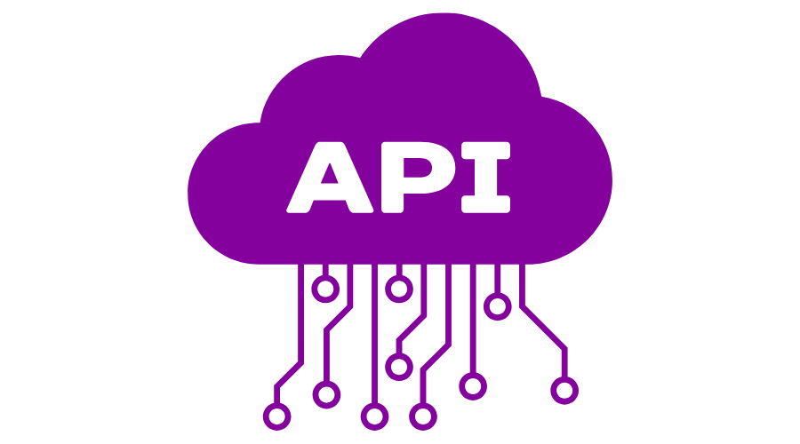

# Proposition technique pour la réalisation du projet

   
Dans cette présentation technique, nous détaillerons les choix techniques retenus pour chaque composante du projet, en expliquant les raisons qui ont motivé ces choix. Nous présenterons également l'architecture technique globale du projet, ainsi que les différentes étapes de développement prévues.

Cette présentation technique a pour objectif de fournir une vision claire et précise des choix techniques retenus, afin de garantir la cohérence et la pérennité du projet. Elle permettra également de faciliter la communication entre les différents acteurs du projet, en fournissant un référentiel technique commun.

Nous avons établi un cadre de référence détaillé pour guider nos choix technologiques, répondant ainsi à divers critères spécifiques. Ce cadre a été synthétisé dans un tableau de questions globales que nous avons soigneusement rempli, permettant d'assurer une cohérence avec nos objectifs et exigences.

Ce document peut être consulté en cliquant <a href="benchmark/global-questions.md">ici</a>.

## 👀 Identification des technologies

| Technologies  | Description                                                                                                     |
|---------------|-----------------------------------------------------------------------------------------------------------------|
| PHP Symfony   | PHP Symfony est un framework PHP open source permettant de créer des applications web robustes et évolutives côté Serveur |
| Twig          | Twig est le moteur de template pour PHP recommandé par Symfony, permettant de créer des vues dynamiques et réactives |
| React         | React est une bibliothèque JavaScript open source pour créer des interfaces utilisateur interactives et réactives, en utilisant un modèle de composants réutilisables. |
| TypeScript    | TypeScript est un langage de programmation typé superset de JavaScript, qui ajoute des types statiques optionnels, particulièrement utilisé avec React pour améliorer la qualité du code |
| PostgreSQL    | PostgreSQL est un système de gestion de base de données relationnelles de haute performance Open Source et évolutif |
| Doctrine ORM  | Doctrine ORM est une bibliothèque PHP qui facilite l'interaction avec les bases de données de manière simple et sécurisée |

## 📄 Proposition d'une API

Pour construire notre API, le choix s'est porté sur l'architecture RESTful, en raison de ses caractéristiques particulièrement adaptées à nos exigences. Voici pourquoi cette architecture est au cœur de notre projet :

- **Compatibilité universelle :** Notre API vise à être accessible depuis diverses applications et dispositifs. Grâce à REST, qui repose sur le standard HTTP, nous assurons une large compatibilité, facilitant ainsi son intégration.
- **Facilité d'évolution :** L'architecture RESTful offre une grande souplesse pour les mises à jour futures. Les modifications ou ajouts de ressources se font sans incidence sur l'utilisation actuelle, un atout majeur pour l'adaptabilité de notre API.
- **Optimisation des performances :** Dans le contexte d'un nombre croissant de requêtes, REST se distingue par sa capacité à optimiser la charge serveur. Cette efficience contribue directement à la réactivité et à la stabilité de notre service.
- **Clarté structurelle :** L'assignation d'une URL spécifique à chaque ressource simplifie la conception et la gestion de notre API. Cette organisation favorise une meilleure division logique et une maintenance allégée.

L'implémentation de REST dans notre projet a pour but proposer une API qui soit à la fois universellement intégrable, aisément extensible, hautement performante et intuitive à gérer.

## ⚛️ Proposition de langage

Le choix de PHP Symfony au lieu d'autres languages a été guidé par plusieurs considérations essentielles.

Premièrement, PHP Symfony est un framework open-source robuste, offrant une structure et des outils qui accélèrent significativement le développement des applications web. La facilité de débogage et la performance globale sont grandement améliorées grâce à ses composants bien conçus et à son système de gestion d'exceptions.

Ensuite, Symfony enrichit PHP avec une approche de programmation orientée objet avancée. Il permet l'utilisation de concepts tels que l'héritage, les interfaces, et les traits, rendant le code non seulement plus structuré, mais aussi plus modulaire et évolutif. Cette modularité est cruciale pour soutenir la croissance et l'évolution de l'application sur le long terme.

La documentation de Symfony est également un point fort notable. Extrêmement détaillée et bien maintenue, elle offre une ressource précieuse pour les développeurs, facilitant l'apprentissage du framework et la résolution de problématiques complexes. Cette richesse documentaire contribue à une meilleure maintenabilité du code et à une plus grande efficacité dans le développement.

De plus, l'écosystème Symfony est compatible avec un large éventail d'outils de développement et de bibliothèques PHP, permettant une intégration fluide avec d'autres technologies et services. Cette compatibilité étendue assure une grande flexibilité dans le choix des meilleures solutions pour chaque aspect du projet

En somme, PHP Symfony se distingue comme un framework performant et polyvalent, apportant une structure rigoureuse, une documentation exhaustive, et une compatibilité étendue au développement PHP. Ces atouts font de lui le choix privilégié pour notre projet, nous permettant de construire une application fiable, maintenable, et prête pour l'avenir.

Ce document peut être consulté en cliquant <a href="benchmark/back-end-framework.md">ici</a>.

## 🎨 Proposition de Framework Front-End

Le choix de React couplé à TypeScript au lieu de Vue.js a été guidé par plusieurs raisons clés.
D'une part, React est une bibliothèque JavaScript de création d'interfaces utilisateur développée par Facebook. Sa popularité et son large écosystème offrent une grande variété de ressources, y compris une communauté active et des bibliothèques complémentaires robustes. L'architecture basée sur les composants de React permet une réutilisation efficace du code et une meilleure gestion de l'état de l'application, facilitant le développement d'applications complexes et dynamiques.

L'association de React avec TypeScript, un langage développé par Microsoft, renforce encore notre choix. TypeScript étend JavaScript en y ajoutant des types statiques, ce qui améliore considérablement le processus de développement grâce à une détection précoce des erreurs et une autocomplétion intelligente. Ce duo permet de structurer le code de manière plus solide et de bénéficier d'une meilleure maintenance et évolutivité du projet.

La combinaison React et TypeScript nous offre une solution robuste pour construire des applications à grande échelle, en tirant parti de la vérification de type au moment de la compilation et d'une architecture orientée composants. De plus, TypeScript améliore la lisibilité et la maintenabilité du code, des atouts précieux pour le travail en équipe et la pérennité des projets.
En somme, l'alliance de React et TypeScript s'aligne avec notre vision de créer des applications web modernes, performantes et facilement maintenables. Cet assemblage s'est avéré être le plus adapté à nos exigences, offrant à la fois flexibilité, sécurité de type et une vaste communauté de support.

Ce document peut être consulté en cliquant <a href="benchmark/front-end-frameworks.md">ici</a>.

## 📑 Proposition de base de donnée

Notre choix s'est porté sur PostgreSQL comme solution de gestion de base de données pour notre projet, pour plusieurs raisons notables :

- **Solidité éprouvée :** L'utilisation de PostgreSQL dans des projets d'envergure, comme Instagram, atteste de sa fiabilité.
- **Capacité de gestion des données :** Sa compétence à manipuler de vastes volumes de données correspond parfaitement à nos attentes, notamment pour la conservation et l'analyse des informations à long terme.
- **Support communautaire :** Une communauté dynamique entoure PostgreSQL, offrant une aide précieuse pour le dépannage et l'optimisation de nos bases de données.
- **Accessibilité du code source :** L'aspect open source de PostgreSQL nous permet d'ajuster et de personnaliser les bases de données en fonction de nos spécificités.

Convaincus par ces atouts, nous avons déterminé que PostgreSQL représente la solution idéale pour la gestion et la sauvegarde des données au sein de notre application.

## 💡 Proposition d'ORM

Nous avons décidé d'opter pour Doctrine ORM de Symfony comme interface de mappage objet-relationnel (ORM) pour faciliter et sécuriser les interactions entre notre application et les bases de données. Voici les raisons qui ont guidé notre choix vers Doctrine :

- **Intégration native avec Symfony :** Étant le ORM par défaut de Symfony, Doctrine offre une intégration fluide et cohérente avec le framework, ce qui garantit une synergie parfaite pour nos besoins de développement, en particulier en utilisant PHP comme langage principal.
- **Communauté dynamique et documentation exhaustive :** Doctrine bénéficie d'une communauté active et d'une documentation complète, facilitant la résolution rapide de problèmes et l'accès à une vaste gamme de fonctionnalités pour enrichir notre application.
- **Open source et flexible :** En tant qu'ORM open source, Doctrine nous laisse une grande liberté de personnalisation et d'ajustement pour répondre spécifiquement à nos exigences projet.
- **Performance et support de plusieurs SGBD :** Doctrine est reconnu pour sa performance et sa capacité à supporter divers systèmes de gestion de bases de données, y compris PostgreSQL, ce qui le rend adaptable à différents environnements de production.
- **Gestion avancée des schémas :** Avec Doctrine, la synchronisation des schémas de base de données avec les entités du code est simplifiée, offrant un gain de temps précieux dans le cycle de développement.
- **Fonctionnalités de migration :** Les outils de migration de Doctrine facilitent l'évolution et la mise à jour du schéma de base de données, assurant ainsi une gestion efficace au fil du temps.
- **Simplicité d'utilisation :** Doctrine est apprécié pour son interface intuitive, rendant le travail avec les bases de données plus accessible et moins sujet aux erreurs.

En conclusion, Doctrine ORM se présente comme une solution robuste et versatile pour notre projet, alliant sécurité, efficacité et facilité d'utilisation. Sa forte intégration avec Symfony, couplée à son large éventail de fonctionnalités, en fait le choix idéal pour une gestion optimale de nos données.

## 🛠️ Autres outils

Dans le développement de notre projet, nous avons opté pour l'utilisation d'outils open source, non seulement pour bénéficier de leur flexibilité et de leur coût réduit, mais aussi pour profiter de leur robustesse et de la richesse de leurs fonctionnalités.

### 💻 Visual Studio Code
Visual Studio Code se distingue comme éditeur de code. Il est particulièrement prisé pour le développement de logiciels grâce à sa flexibilité, ses nombreuses fonctionnalités, sa performance élevée et son modèle de développement ouvert et communautaire.

### 🐈‍⬛ GitHub
GitHub, un outil open source incontournable, a joué un rôle clé dans le développement de notre application pour le Bad's Club. Cette plateforme nous a permis de centraliser notre répertoire de code dans un environnement en ligne sécurisé, rendant le projet accessible à toute l'équipe, quel que soit leur emplacement géographique. Grâce à GitHub, nous avons facilité une collaboration continue et efficace, cruciale pour le succès de notre projet.

### 🦊 Firefox
Firefox, développé par Mozilla, une organisation à but non lucratif, joue également un rôle clé dans notre environnement de développement. Ce navigateur garantit la priorité donnée à la vie privée et à la sécurité des utilisateurs, en bloquant par défaut les traceurs tiers et en offrant des options avancées de confidentialité. Sa capacité de personnalisation est également remarquable, offrant une vaste gamme d'extensions et de thèmes qui permettent aux utilisateurs de personnaliser leur expérience de navigation. Firefox est optimisé pour une navigation rapide et efficace, même avec de nombreux onglets ouverts, et inclut des outils de développement intégrés qui facilitent la création et le débogage de sites web.

## 🛡️ Stratégie de sécurisation

Notre stratégie multicouche se concentre sur la prévention, la détection et la réponse aux menaces, s'appuyant sur les bonnes pratiques de développement et les recommandations de l'ANSSI et de la CNIL.

Ce document peut être consulté en cliquant <a href="security-strategy.md">ici</a>.